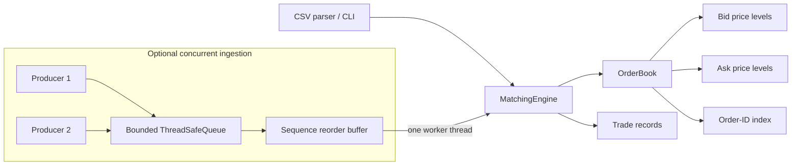

# C++ Matching Engine

[](https://github.com/gabrielchangamire-arch/cpp-matching-engine/actions/workflows/ci.yml)

[](LICENSE)

A compact C++20 limit order book and matching engine with deterministic
price-time priority, indexed cancellation, a CSV demonstration program, and a
bounded multi-producer ingestion layer. The project is deliberately small
enough to explain end to end while still exercising the engineering practices
expected of production systems code.

## Why this project exists

Matching an order is conceptually simple; doing it with explicit invariants,
predictable ordering, efficient data structures, safe concurrency, reproducible
tests, and honest performance evidence is not. This repository demonstrates
those concerns without hiding them behind networking, persistence, or a large
framework.

## Features

- Validated limit orders and trades with integer tick prices
- Deterministic price-time-priority matching at the resting order's price
- Full fills, partial fills, multi-fill orders, and resting remainders
- Average constant-time active-order lookup for cancellation
- Best bid/ask, aggregated depth, and readable book snapshots
- CSV add/cancel CLI that reports malformed or rejected commands and continues
- Bounded blocking queue, futures, backpressure, and graceful shutdown
- 84 discovered unit, differential, integration, CLI, queue, and concurrency tests
- Coverage-guided CSV parsing and command validation with Clang libFuzzer
- Google Benchmark workloads plus an actual profile-guided optimization
- Strict compiler warnings, clang-format, clang-tidy, sanitizers, and CI

## Architecture



The reusable `MatchingEngine` is single-threaded by design. The optional
`ConcurrentMatchingEngine` owns one worker that serializes commands before they
reach the core, so the order book itself needs no internal locking. See
[the architecture notes](docs/architecture.md) for component and ownership
details.

## Order-matching rules

1. The highest bid and lowest ask have price priority.
2. Orders at one price execute in FIFO arrival order.
3. An incoming order crosses while a buy price is at least the best ask, or a
   sell price is at most the best bid.
4. A trade uses the resting order's price and the smaller remaining quantity.
5. Filled resting orders leave the book; an incoming remainder rests at its
   limit price.
6. Order IDs are unique for the engine's lifetime, including after fill or
   cancellation.

Monotonic sequence numbers make both order priority and trade order explicit.
Prices are signed 64-bit integer ticks, not floating point.

## Data-structure choices

- `std::map<Price, PriceLevel>` keeps bids descending and asks ascending, making
  the best level the first map entry.
- Each `PriceLevel` owns a `std::list<Order>` so insertion is FIFO and erasing a
  known order does not invalidate iterators to its neighbors.
- `std::unordered_map<OrderId, OrderLocation>` maps active IDs to their side,
  price, and stable list iterator for direct cancellation.
- `std::unordered_set<OrderId>` remembers every accepted ID and prevents reuse.
- `std::variant<AddCommand, CancelCommand>` represents a closed command set
  without inheritance or owning raw pointers.

These containers favor a readable, correct baseline. They trade cache locality
and allocation count for stable iterators and straightforward complexity.

## Complexity

Let `P` be the number of price levels, `L` the number of depth levels returned,
and `K` the number of resting orders filled.

| Operation | Expected time | Notes |
|---|---:|---|
| Insert non-crossing order | `O(log P)` | Map lookup/insertion; list append and ID index are average `O(1)` |
| Best bid or ask | `O(1)` | Reads the first ordered-map entry |
| Cancel active order | Average `O(1)`; `O(log P)` if a level empties | Hash lookup and list erase; empty map level is erased |
| Match incoming order | `O(K + E log P)` expected | `E` is the number of emptied price levels |
| Query `L` depth levels | `O(min(L, P))` | Quantity is maintained per level |
| Active-order lookup | Average `O(1)` | Hash index |

Memory is `O(N + P + H)`: active orders, price levels, and lifetime order-ID
history respectively.

## Build

Prerequisites are a C++20 compiler, CMake 3.20+, Git, and network access for the
first dependency fetch. GoogleTest and Google Benchmark are pinned through
CMake `FetchContent`.

```sh
cmake -S . -B build -DCMAKE_BUILD_TYPE=Debug
cmake --build build --parallel
./build/matching_engine_cli examples/sample_orders.csv
```

The project enables `-Wall -Wextra -Wpedantic -Werror` on Clang/GCC (`/W4 /WX`
on MSVC).

## Test

```sh
ctest --test-dir build --output-on-failure
```

CTest discovers 83 GoogleTest cases individually and adds the sample CLI as an
end-to-end test, for 84 tests total. One test executes 12,000 deterministic
random commands against both the production engine and an independent
vector-based reference model, comparing trades and book state after every
command.

## Sanitizers and static checks

Use separate build trees because ASan and TSan are intentionally not combined:

```sh
# AddressSanitizer + UndefinedBehaviorSanitizer
cmake -S . -B build-asan -DCMAKE_BUILD_TYPE=Debug \
  -DMATCHING_ENGINE_ENABLE_ASAN_UBSAN=ON
cmake --build build-asan --parallel
ctest --test-dir build-asan --output-on-failure

# ThreadSanitizer
cmake -S . -B build-tsan -DCMAKE_BUILD_TYPE=Debug \
  -DMATCHING_ENGINE_ENABLE_TSAN=ON
cmake --build build-tsan --parallel
ctest --test-dir build-tsan --output-on-failure

# clang-format and clang-tidy
cmake --build build --target format-check
cmake -S . -B build-tidy -DCMAKE_BUILD_TYPE=Debug \
  -DMATCHING_ENGINE_ENABLE_CLANG_TIDY=ON
cmake --build build-tidy --parallel
```

Sanitizer availability depends on the compiler and operating system. The full
suite passed locally under ASan/UBSan and TSan on the environment documented
below.

### Fuzzing

The optional fuzz build requires a Clang distribution that includes libFuzzer.
Apple's Command Line Tools package may omit that runtime; Homebrew LLVM and the
Ubuntu Clang package include it.

```sh
cmake -S . -B build-fuzz -DCMAKE_BUILD_TYPE=RelWithDebInfo \
  -DCMAKE_CXX_COMPILER=clang++ \
  -DBUILD_TESTING=OFF \
  -DMATCHING_ENGINE_BUILD_FUZZERS=ON
cmake --build build-fuzz --target csv_command_fuzzer --parallel
./build-fuzz/csv_command_fuzzer \
  -dict=fuzz/csv_commands.dict \
  -max_len=4096 \
  -max_total_time=10
```

The harness treats documented `std::invalid_argument` rejections as expected;
unexpected exceptions, sanitizer findings, and crashes remain fuzz failures.

## Benchmarks

```sh
cmake -S . -B build-release -DCMAKE_BUILD_TYPE=Release \
  -DBUILD_TESTING=OFF \
  -DMATCHING_ENGINE_BUILD_BENCHMARKS=ON
cmake --build build-release --target matching_engine_benchmark --parallel
./build-release/matching_engine_benchmark \
  --benchmark_min_time=0.1s \
  --benchmark_repetitions=5 \
  --benchmark_report_aggregates_only=true
```

The suite measures insertion, crossing, cancellation, best-price lookup, a
mixed workload, and one- or four-producer ingestion at multiple sizes. Setup
and teardown are paused outside timed regions.

## Example CLI session

Input uses integer price ticks and one command per line:

```text
ADD,order_id,BUY|SELL,price_ticks,quantity
CANCEL,order_id
```

Running the included example produces three exact trades and this final state:

```text
$ ./build/matching_engine_cli examples/sample_orders.csv
ACCEPTED line=2 ADD id=1
ACCEPTED line=3 ADD id=2
ACCEPTED line=4 ADD id=3
ACCEPTED line=5 ADD id=4
TRADE line=5 Trade{id=1, buy_order_id=4, sell_order_id=1, price=10100, quantity=5, sequence=5}
TRADE line=5 Trade{id=2, buy_order_id=4, sell_order_id=2, price=10200, quantity=5, sequence=6}
ACCEPTED line=6 ADD id=5
TRADE line=6 Trade{id=3, buy_order_id=3, sell_order_id=5, price=10000, quantity=4, sequence=8}
ACCEPTED line=7 CANCEL id=2

Processed 6 commands: 6 accepted, 0 rejected

Order book (1 order)
ASKS (best first)
  9900 | qty 2 | orders 1
BIDS (best first)
  (empty)
```

Blank lines and `#` comments are ignored. Rejected lines are written to standard
error, processing continues, and the process exits with status 2 if any command
was rejected.

## Actual benchmark results

Measured on 2026-07-27 with an Apple M5 Pro, 24 GiB RAM, macOS 26.5.2,
Apple Clang 21.0.0, Release mode, and Google Benchmark 1.9.5. Values are medians
of five repetitions and are framework-reported throughput based on CPU time.
The baseline/post table records the version 1.0 allocation-optimization
experiment.

| Benchmark | Work size | Baseline M items/s | Optimized M items/s | Change |
|---|---:|---:|---:|---:|
| Order insertion | 100 resting | 16.98 | 24.83 | +46.3% |
| Order insertion | 1,000 resting | 9.63 | 25.45 | +164.2% |
| Crossing match | 1,000 fills | 39.28 | 37.38 | -4.8% |
| Cancellation | 1,000 resting | 0.94 | 1.14 | +21.3% |
| Best bid + ask | 1,000 resting | 1,079.94 | 1,076.30 | -0.3% |
| Mixed workload | 1,000 operations | 20.53 | 25.85 | +25.9% |
| Single producer | 1,000 commands | 2.62 | 4.17 | +59.5% |
| Four producers | 1,000 commands | 3.00 | 8.69 | +189.4% |

For the four-producer 1,000-command case, median wall time moved from 611.4 us
to 446.0 us, equivalent to about 1.64 to 2.24 million commands/s (+37.1%). Wall
time is the more meaningful concurrency number because process CPU time behaves
differently when work spans threads. These are microbenchmarks on one laptop,
not exchange-scale latency claims. Full results and caveats are in
[docs/performance.md](docs/performance.md).

Version 1.1 added bounded sequence admission and in-flight sequence cleanup, so
its ingestion path was measured again. At 1,000 commands, the current code
reported median CPU-time throughput of 3.76 M commands/s for one producer and
5.55 M commands/s for four producers. Median wall times were 346.3 us and
511.2 us respectively (about 2.89 M and 1.96 M commands/s). This check ran under
different system load and is not presented as a direct regression comparison.

## Profiling finding and optimization

The macOS `sample` profiler repeatedly observed
`MatchingEngine::submit_limit_order +368`; disassembly mapped that location to
an allocation caused by `trades.reserve(book_.order_count())`. The engine was
reserving trade storage even for non-crossing submissions, where the returned
trade vector stays empty.

The optimized code first checks whether the best opposite order actually
crosses and reserves only then. This removed a needless heap allocation from
the common insertion path and improved the mixed workload median by 25.9%.
Crossing-only results did not improve and varied by roughly 4-5% in the full
run; a separate ten-repetition 1,000-fill check measured 39.03 M fills/s versus
the 39.28 M baseline, effectively unchanged for this experiment.

## Concurrency model

Multiple producers may call `submit(sequence, command)`. Each command enters a
bounded queue; condition variables block producers when full and wake the
worker without busy waiting. The worker holds out-of-order commands in an
ordered buffer and applies only the next contiguous ingestion sequence. By
default, admission rejects a sequence more than 1,024 positions ahead of the
next expected value, which also bounds the reorder buffer. Processed ingestion
IDs are removed from the in-flight duplicate set. A future returns acceptance,
trades, or a validation error to the producer.

Only that worker mutates `MatchingEngine`, preserving deterministic behavior
and avoiding pervasive book locks. Shutdown stops acceptance, closes the queue,
wakes waiters, rejects commands after sequence gaps, and joins the worker. This
is synchronized and intentionally not lock-free.

## Correctness guarantees

- Accepted orders have positive IDs, prices, quantities, and sequences.
- Every accepted ID is unique for the engine's lifetime.
- Matching is deterministic for a deterministic command sequence.
- Price priority precedes FIFO time priority.
- Trades use the resting price and never exceed either remaining quantity.
- Book-level totals are updated after fills and cancellations.
- Unknown cancellation cannot corrupt or crash the core engine.
- Concurrent producers cannot mutate the order book directly.

These guarantees are enforced by constructors and engine checks and exercised
by 84 tests, including exact-trade integration scenarios, concurrent submission,
and comparison against a deliberately simple reference matcher. ASan/UBSan,
TSan, and a libFuzzer smoke run add dynamic memory, undefined-behavior, race, and
malformed-input checks; they do not constitute a formal proof.

## Known limitations

- One in-memory book and one limit-order type; no symbols, market orders,
  replace command, persistence, recovery, or networking
- Prices are caller-defined ticks; currency scale and tick-size policy are not
  encoded in the type
- The lifetime ID set grows even after orders finish
- Concurrent ingestion requires positive, unique, contiguous caller-supplied
  sequence numbers; missing sequences within the configured window delay later
  commands until shutdown
- CSV parsing intentionally omits quoted fields and headers
- Standard containers allocate dynamically; allocation failure is not handled
  transactionally
- Benchmarks do not measure kernel-bypass I/O, tail latency, or production load

## Potential future work

- Multi-symbol sharding with one matching thread per book or partition
- Modify/cancel-replace semantics and additional time-in-force policies
- Snapshotting, event logging, replay, and crash recovery
- Strong price/quantity value types with instrument tick validation
- Memory pools or flat/contiguous price-level structures, justified by profiles
- Sequence-gap timeout/recovery policy and richer backpressure telemetry
- HDR-histogram end-to-end latency measurements under pinned, controlled load
- Longer scheduled fuzzing and additional conservation properties

## More documentation

- [Architecture](docs/architecture.md)
- [Architecture decisions](docs/decisions.md)
- [Performance investigation](docs/performance.md)

## License

Licensed under the [MIT License](LICENSE).
