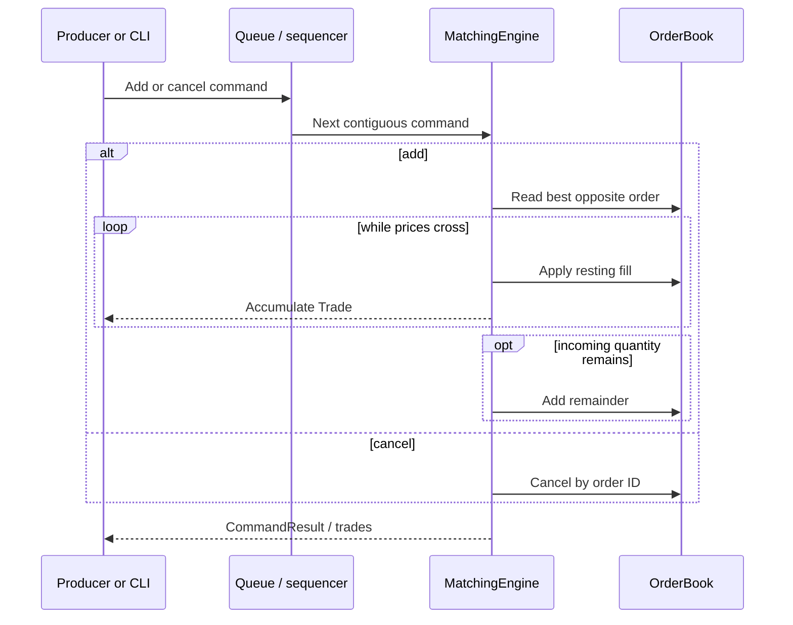

# Architecture

## Purpose and boundaries

This project models one in-memory limit order book. Its boundary begins with a
validated API call or parsed CSV command and ends with generated trade records
and queryable book state. Networking, persistence, account risk, market data
distribution, and multiple instruments are intentionally outside the design.

## Components

| Component | Responsibility |
|---|---|
| `Order` and `Trade` | Own validated domain state and expose read-only accessors |
| `OrderBook` | Own active orders, price levels, aggregate quantities, and cancellation index |
| `MatchingEngine` | Assign sequences/trade IDs, reject reused IDs, execute crossing orders, and rest remainders |
| CSV command layer | Parse add/cancel records, isolate per-line errors, invoke the reusable engine, and format output |
| `ThreadSafeQueue<T>` | Provide bounded blocking FIFO transport, deadline-aware waits, backpressure, close, and waiter wakeup |
| `ConcurrentMatchingEngine` | Accept producers, reorder by explicit ingestion sequence, serialize mutations, and return futures |
| Benchmark executable | Exercise focused and mixed workloads while excluding setup/teardown from timed regions |

Public interfaces live under `include/matching_engine`; implementations live in
`src`. Tests and benchmarks link the same `matching_engine` library used by the
CLI.

## Data flow

The CLI bypasses the queue and calls the core directly. The concurrent facade
uses the same core, but calls it only from its worker.

## Core data structures

`OrderBook` maintains three coordinated views:

1. Bids are an ordered map with descending prices.
2. Asks are an ordered map with ascending prices.
3. Active IDs are a hash map to `{side, price, list iterator}`.

Each map value is a price level containing a FIFO `std::list<Order>` and a
cached total quantity. Ordered maps make the best price their `begin()` entry.
The list provides stable iterators, so the hash index can erase a known order
without scanning its level. Cached totals make each returned depth level
constant work.

The matching engine also owns a lifetime `std::unordered_set<OrderId>`, a next
domain sequence, and a next trade ID. The lifetime set makes ID reuse
unambiguous even after an order is no longer active.

## Matching path

For a new order, the engine:

1. Rejects an ID that has appeared before and constructs a validated `Order`.
2. Looks at the best order on the opposite side.
3. While the prices cross, executes the smaller remaining quantity at the
   resting order's price.
4. Updates or removes the resting order and emits a sequenced `Trade`.
5. Adds any incoming remainder to its side of the book.

Only the `MatchingEngine` may call the book's private `best_order` and `fill`
operations. This friendship keeps mutable order access out of the public query
API while avoiding a wider abstraction for two tightly related components.

## Threading model

The core engine is deliberately single-threaded and has no internal mutexes.
`ConcurrentMatchingEngine` adds concurrency at the command boundary:

- Producers submit an explicit positive ingestion sequence and receive a
  `std::future<CommandResult>`.
- A bounded `ThreadSafeQueue<Envelope>` uses a mutex and two condition variables
  (`not_empty` and `not_full`). Waiting threads sleep rather than spin.
- One worker moves envelopes into an ordered map and processes only the next
  contiguous sequence.
- Admission limits sequences to a configurable window ahead of the next
  expected value (1,024 by default), bounding the ordered buffer independently
  of producer behavior.
- Once an out-of-order command exposes a gap, the worker uses one fixed,
  configurable deadline (one second by default). Later arrivals do not extend
  it. If it expires, the worker stops admission, closes and drains the queue,
  and rejects every buffered command with the missing sequence in the error.
- A small state mutex protects acceptance, submitted sequence IDs, worker state,
  and post-shutdown snapshot access. A separate shutdown mutex makes shutdown
  idempotent and serializes joining.

The submitted-sequence hash set contains only commands that are queued, pending,
or executing. The worker removes each sequence after processing, while stale
values are rejected by comparing them with the next expected sequence. This
keeps duplicate detection bounded by the configured admission window rather
than process lifetime.

This single-writer design makes price-time behavior independent of producer
scheduling. Putting locks throughout `OrderBook` would make multi-step matches
harder to reason about, increase lock traffic, and still require a policy to
decide which simultaneous command logically arrived first.

## Ownership model

- `MatchingEngine` owns its `OrderBook`; `OrderBook` owns every active `Order`.
- Price levels own orders by value. The ID index stores non-owning iterators
  whose validity is guaranteed by `std::list` until that exact order is erased.
- `ConcurrentMatchingEngine` owns its queue, core engine, and worker thread.
- Each queued envelope owns its command and promise. The submitting caller owns
  the matching future.
- Trade vectors are returned by value. C++ move elision/move construction
  transfers their storage without shared ownership.

There are no raw owning pointers. RAII ensures container storage, locks,
futures, and the worker thread are released through normal object lifetimes;
the concurrent facade's destructor invokes shutdown.

## Error handling

Domain constructors throw `std::invalid_argument` for invalid values and
`std::overflow_error` for impossible aggregate/sequence progress. Core unknown
cancellation returns `false`, allowing each caller to choose policy.

The CSV layer catches errors per line, reports the line number, continues, and
returns a rejected-command count. The concurrent layer converts command-level
exceptions into a rejected `CommandResult`; API misuse such as zero/duplicate
ingestion sequences, stale sequences, sequences outside the configured window,
or submission after shutdown throws immediately. A terminal gap timeout is also
returned by every buffered future and by subsequent submission attempts, so
callers receive a consistent recovery reason.

Allocation failure is allowed to propagate. The implementation does not claim
a strong transactional exception guarantee for out-of-memory conditions.

## Determinism

For a fixed command sequence, output is deterministic because:

- Ordered maps define best-price traversal.
- Lists preserve insertion order within a price.
- Sequence counters advance in one matching thread.
- The concurrent facade requires explicit, unique ingestion sequences and
  applies them contiguously.
- Execution price is always the already-resting order's price.

Wall-clock timestamps and thread scheduling never participate in priority.
Missing concurrent sequences trigger a fail-closed deadline rather than
allowing later commands to execute in a different order. Already-applied book
state remains available after shutdown for snapshot and trusted replay.

## Verification strategy

Example-driven unit tests cover named edge cases. A deterministic differential
test adds a second line of defense: 24 random seeds generate 500 commands each,
and a simple vector-scanning reference matcher independently computes expected
trades and book state. The test compares trade IDs, sides, prices, quantities,
sequences, full depth, best prices, active counts, and the invariant that the
resting book is never crossed after a command.

The CSV fuzz target instruments both parsing and command validation with
libFuzzer, AddressSanitizer, and UndefinedBehaviorSanitizer. CI runs a short
smoke session; longer local or scheduled runs can reuse the same harness.
